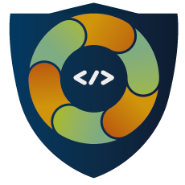
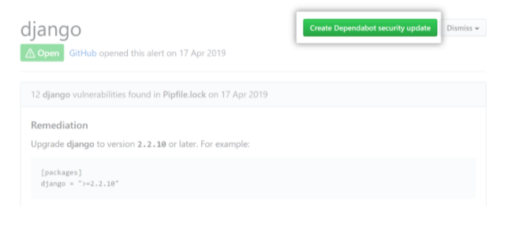
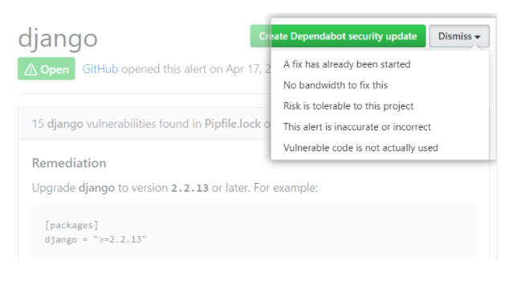

<h1 align="center">
  
   
  Criação do Pull Request para atualização das dependências - DependaBot.
</h1>

Este documento serve para demonstrar como fazer a atualização de dependências automáticas utilizando o github.

----

 

### Passo 1

Crie um pull request para resolver a vulnerabilidade. A imagem abaixo demonstra onde deve ser clicado no Github.

 

### Passo 2

Após avalição sobre o impacto e que o seu código esta pronto para atualizar a dependência e resolver a vulnerabilidade, faça merge da pull request. 

 

### Opcional - Falso Positivo

Se o alerta que estiver sendo corrigido estiver incorreto, ou localizado em um código não utilizado, use o menu suspenso "Ignorar", e clique em um motivo para ignorar o alerta.

---

<a href="../README.md" style="float: left;">Indice</a>
<a href="README.md" style="float: right;">Voltar</a>