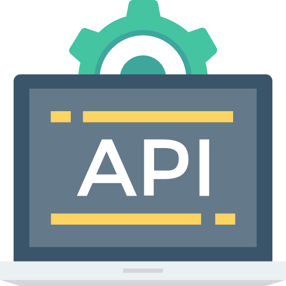

<h1>
    
    <strong>Requisitos de Segurança em APIs</strong> 
</h1>

## Conteúdo

* [Autenticação](#authentication)
* [Acesso](#access)
* [Inputs e Processamento de Dados](#inputs)

- - -

<h2 id="authentication" style="font-weight:bold">
  
        Autenticação
</h2>

Autenticação diz respeito à verificação da identidade da pessoa/serviço que está realizando aquela requisição, de modo que precisamos de mecanismos que garantam essa verificação de forma segura. Para isso utilizamos sistemas reconhecidamente seguros como OAuth e JSON Web Token, sendo importante também garantir as configurações corretas desses componentes.

<table>
    <thead>
        <tr>
            <th></th>
            <th>Requisito</th>
        </tr>
    </thead>
    <tbody>
        <tr>
            <td width="20px"></td>
            <td>Limite e bloqueio por várias tentativas de autenticação falhas em seguida;</td>
        </tr>
        <tr>
            <td width="20px"></td>
            <td>Não implemente mecanismos de autenticação próprios, utilize o padrão de autenticação <a href="https://oauth.net/2/">OAuth</a>;</td>
        </tr>
        <tr>
            <td width="20px"></td>
            <td>Utilize Tokens de segurança aleatórios e complexos como <a href="https://jwt.io/">JWT Secret</a>;</td>
        </tr>
        <tr>
            <td width="20px"></td>
            <td>Não utilize o algoritmo padrão de criptografia informado no cabeçalho do payload. Force o uso de um algoritmo específico no back-end (<code>HS256</code> ou <code>RS256</code>);</td>
        </tr>
                <tr>
            <td width="20px"></td>
            <td>Expiração de vida do token (<code>TTL</code>, <code>RTTL</code>) o menor possível;</td>
        </tr>
                <tr>
            <td width="20px"></td>
            <td>Valide o <code>redirect_uri</code> no seu servidor através de uma lista de URLs conhecidas (previamente cadastradas);</td>
        </tr>
                <tr>
            <td width="20px"></td>
            <td>Retorne códigos de negociação, não o *token* de acesso (não permita <code>response_type=token</code>);</td>
        </tr>
                <tr>
            <td width="20px"></td>
            <td>Utilize o parâmetro <code>state</code> com um *hash* aleatório para prevenir CSRF no processo de autenticação OAuth;</td>
        </tr>
                <tr>
            <td width="20px"></td>
            <td>Defina escopo de dados, e valide o parâmetro <code>scope</code> para cada aplicação;</td>
        </tr>
    </tbody>
    <thead>
</table>

- - -

<h2 id="access" style="font-weight:bold">
  
        Acessos
</h2>
    É preciso garantir parâmetros gerais de segurança a cada acesso às APIs, como Rate Limit e requisições encriptadas.

<table>
    <thead>
        <tr>
            <th></th>
            <th>Requisito</th>
        </tr>
    </thead>
    <tbody>
        <tr>
            <td width="20px"></td>
            <td>Use cabeçalho <code>HSTS</code> com SSL para evitar ataques <b>SSL Strip</b>(<a href="https://www.nginx.com/blog/http-strict-transport-security-hsts-and-nginx/">Exemplo utilizando Nginx</a>);</td>
        </tr>
        <tr>
            <td width="20px"></td>
            <td>Use HTTPS no seu servidor para evitar ataques MITM (<b>Man In The Middle Attack</b>);;</td>
        </tr>
        <tr>
            <td width="20px"></td>
            <td>Limite a quantidade de requisições (<b>Throttling</b>) para evitar ataques DDoS e de força bruta;</td>
        </tr>
        <tr>
            <td width="20px"></td>
            <td>Garanta que endpoints sensíveis estejam protegidos pelo sistema de autenticação;</td>
        </tr>
    </tbody>
    <thead>
</table>

- - -

<h2 id="inputs" style="font-weight:bold">
  
        Inputs e Processamento de dados
</h2>
    Além dos filtros criados no Front-End das aplicações, é preciso realizar validações dos dados enviados pelo usuário no seu envio para o Back-End, ou seja, para sua entrada nas APIs. Dessa forma, evitamos algumas vulnerabilidades comuns como SQL Injection e Cross-site Scripting. É também preciso olhar para o modo como processamos os dados para seu armazenamento.

<table>
    <thead>
        <tr>
            <th></th>
            <th>Requisito</th>
        </tr>
    </thead>
    <tbody>
        <tr>
            <td width="20px"></td>
            <td>Escapar tags HTML e JavaScript;</td>
        </tr>
        <tr>
            <td width="20px"></td>
            <td>Utilização de white-lists para receber apenas caracteres e strings com formatos que façam sentido no contexto do Input;</td>
        </tr>
        <tr>
            <td width="20px"></td>
            <td>Filtrar argumentos SQL;</td>
        </tr>
        <tr>
            <td width="20px"></td>
            <td>Utilizar <a href="https://developer.mozilla.org/pt-BR/docs/Web/HTTP/Headers/Content-Security-Policy">Content-Security-Policy</a> nos Headers de requisições;</td>
        </tr>
        <tr>
            <td width="20px"></td>
            <td>Ao gerar IDs use identificadores únicos aleatórios para evitar vulnerabilidades como IDOR;</td>
        </tr>
    </tbody>
    <thead>
</table>

---

<h4><strong>Artigos e Referências</strong></h4>

* [<i>The OAuth 2.0 Authorization Framework](https://tools.ietf.org/html/rfc6749)

* [Controlar a Sessão com Spring Security](https://www.codeflow.site/pt/article/spring-security-session)

* [Keep Track of Logged In Users with Spring Security](https://www.baeldung.com/spring-security-track-logged-in-users)

* [Authentication API Endpoint Rate Limits](https://auth0.com/docs/policies/rate-limit-policy/authentication-api-endpoint-rate-limits)

* [JSON Web Token Best Current Practices](https://tools.ietf.org/html/rfc8725)

* [REST Security Cheat Sheet](https://cheatsheetseries.owasp.org/cheatsheets/REST_Security_Cheat_Sheet.html)

* [Hashing vs Encryption vs Salting: What's the difference?](https://cybernews.com/security/hashing-vs-encryption/)

* [Política de segurança de conteúdo](https://developers.google.com/web/fundamentals/security/csp?hl=pt)

* [O que é UUID? Porque usá-lo?](https://medium.com/trainingcenter/o-que-%C3%A9-uuid-porque-us%C3%A1-lo-ad7a66644a2b)
  

- - - -

<h2>Licenças</h2>

    
Ícones feitos por <a href="https://www.freepik.com" title="Freepik">Freepik</a> de <a href="https://www.flaticon.com/" title="Flaticon">www.flaticon.com</a>

